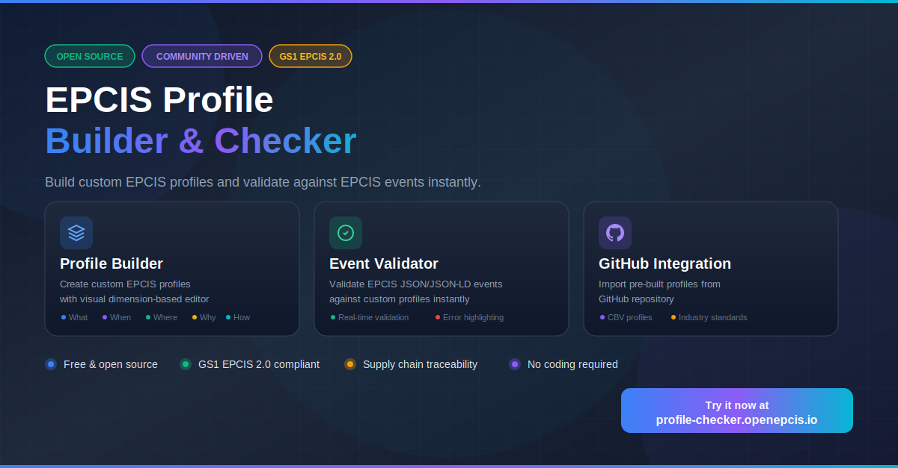

# EPCIS Profile Checker

A collection of web-based tools for working with the [EPCIS](https://www.gs1.org/standards/epcis) standard. Build custom validation profiles, validate events, and search existing snippets.



## Features

### Profile Builder
Build custom JSON Schema profiles for EPCIS event validation. Configure event types, business steps, dispositions, EPC identifiers, and more with an intuitive visual interface.

### Profile Checker
Validate EPCIS events against custom validation profiles. Paste your event JSON and profile to instantly check compliance and identify issues.

### Snippet Search
Search and filter EPCIS event snippets from the library. Find examples for different event types, business steps, and dispositions.

## Quick Start

### Prerequisites
- Node.js 18+
- pnpm

### Installation

```bash
# Clone the repository
git clone https://github.com/openepcis/openepcis-snippet-web.git
cd openepcis-snippet-web

# Install dependencies
pnpm install

# Start development server
pnpm dev
```

The app will be available at `http://localhost:3000`

### Build for Production

```bash
pnpm build
```

## Tech Stack

- [Nuxt 4](https://nuxt.com/) - Vue.js Framework
- [Nuxt UI](https://ui.nuxt.com/) - UI Components
- [Tailwind CSS](https://tailwindcss.com/) - Styling
- [AJV](https://ajv.js.org/) - JSON Schema Validation
- [CodeMirror](https://codemirror.net/) - Code Editor

## License

Apache License 2.0
