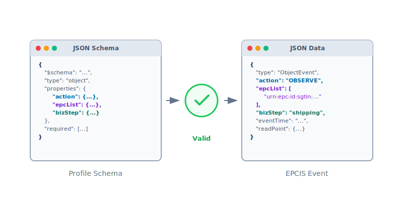
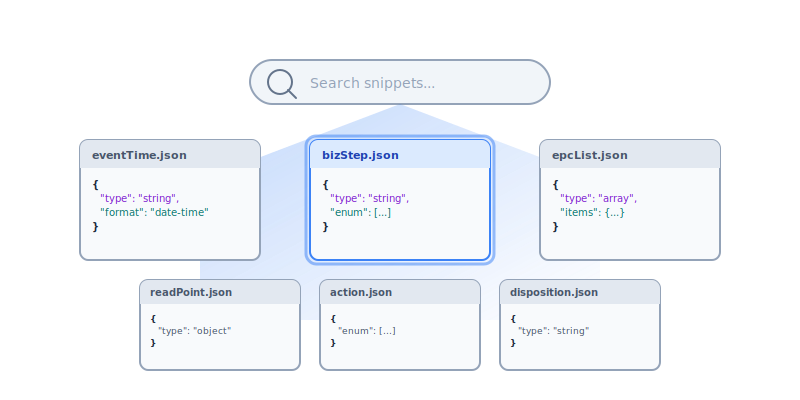

<p align="center">
  <picture>
    <source media="(prefers-color-scheme: dark)" srcset="public/logo-white-circle.svg">
    <source media="(prefers-color-scheme: light)" srcset="public/logo-black-circle.svg">
    
  </picture>
</p>

<h1 align="center">EPCIS Profile Checker</h1>

<p align="center">
  A web application for building, validating, and searching <a href="https://www.gs1.org/standards/epcis">GS1 EPCIS</a> event profiles — enabling supply chain visibility and traceability compliance.
</p>

<p align="center">
  <a href="https://profile-checker.openepcis.io/">Live Web Application</a> &middot;
  <a href="https://github.com/openepcis/openepcis-event-sentry">Event Sentry</a> &middot;
  <a href="DOCKER.md">Docker Guide</a>
</p>

<p align="center">
  <a href="LICENSE"></a>
  <a href="https://github.com/openepcis/openepcis-snippet-web/releases"></a>
  <a href="https://github.com/openepcis/openepcis-snippet-web"></a>
</p>

---

## Features

<table>
  <tr>
    <td align="center" width="33%">
      <picture>
        <source media="(prefers-color-scheme: dark)" srcset="public/profile-builder-dark.svg">
        <source media="(prefers-color-scheme: light)" srcset="public/profile-builder-light.svg">
        
      </picture><br>
      <b>Profile Builder</b><br>
      <sub>Visually create JSON Schema profiles for EPCIS document and event validation</sub>
    </td>
    <td align="center" width="33%">
      <picture>
        <source media="(prefers-color-scheme: dark)" srcset="public/event-validator-dark.svg">
        <source media="(prefers-color-scheme: light)" srcset="public/event-validator-light.svg">
        
      </picture><br>
      <b>Event Validator</b><br>
      <sub>Validate EPCIS events against profiles with instant compliance feedback</sub>
    </td>
    <td align="center" width="33%">
      <picture>
        <source media="(prefers-color-scheme: dark)" srcset="public/snippet-search-dark.svg">
        <source media="(prefers-color-scheme: light)" srcset="public/snippet-search-light.svg">
        
      </picture><br>
      <b>Snippet Search</b><br>
      <sub>Search and filter reusable EPCIS event snippets from the library</sub>
    </td>
  </tr>
</table>

## Getting Started

### Run with Docker / Podman

The quickest way to get started:

```bash
# Docker
docker pull ghcr.io/openepcis/openepcis-snippet-web:latest
docker run -p 3000:3000 ghcr.io/openepcis/openepcis-snippet-web:latest

# Podman
podman pull ghcr.io/openepcis/openepcis-snippet-web:latest
podman run -p 3000:3000 ghcr.io/openepcis/openepcis-snippet-web:latest
```

Open [http://localhost:3000](http://localhost:3000) in your browser. See the [Docker Guide](DOCKER.md) for compose setup and environment variables.

### Run from Source

Requires [Node.js](https://nodejs.org/) 18+ and [pnpm](https://pnpm.io/).

```bash
git clone https://github.com/openepcis/openepcis-snippet-web.git
cd openepcis-snippet-web
pnpm install
pnpm dev
```

Open [http://localhost:3000](http://localhost:3000) in your browser.

### Build for Production

```bash
pnpm build         # Server-side rendered build
pnpm generate      # Static site generation
```

## Development

```bash
pnpm dev            # Start dev server at http://localhost:3000
pnpm build          # Production build
pnpm generate       # Static site generation
pnpm lint           # Run ESLint
pnpm clean          # Remove all build artifacts and dependencies
```

### Project Structure

```
app/
├── pages/              # Route pages (index, profile-builder, event-validator, snippet-search)
├── components/         # Vue components (JsonEditor, config panels, header/footer)
├── composables/        # Reusable logic (GitHub profile fetching, EPC identifiers)
├── data/               # EPCIS field definitions, dimensions, sensor constants
├── types/              # TypeScript interfaces
└── utils/              # Utility functions
```

## Tech Stack

- [Nuxt 4](https://nuxt.com/) — Vue.js framework
- [Nuxt UI](https://ui.nuxt.com/) — UI components
- [Tailwind CSS](https://tailwindcss.com/) — Styling
- [AJV](https://ajv.js.org/) — JSON Schema validation (multi-draft support)
- [CodeMirror 6](https://codemirror.net/) — Code editor with JSON syntax

## Related

- [OpenEPCIS Event Sentry](https://github.com/openepcis/openepcis-event-sentry) — EPCIS event profiles, JSON Schema snippets, and validation SDK
- [GS1 EPCIS Standard](https://www.gs1.org/standards/epcis) — The underlying traceability standard

## Contributing

We welcome contributions! Here are ways to get involved:

- **Bug Reports** — identify and report issues
- **Feature Requests** — suggest improvements
- **Pull Requests** — submit code changes
- **Documentation** — help improve guides

## License

[Apache License 2.0](LICENSE)
